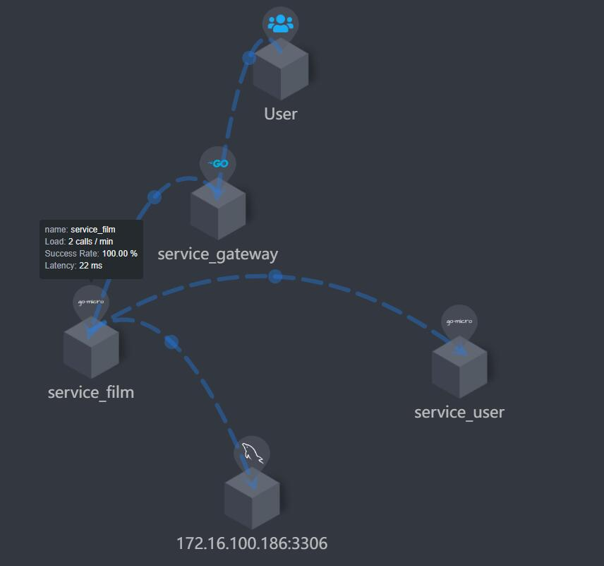
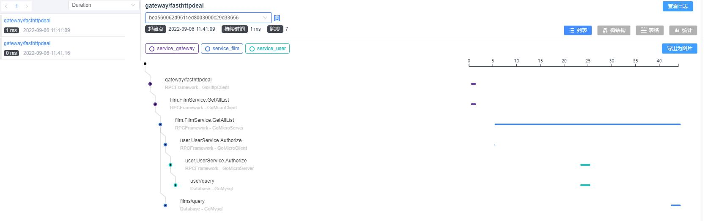

## 接口设计
0.注册用户 ， 用户登录等

1.搜索上映电影 (时间,片名,电影院)

2.电影详情 ,包含院线场次

3.查看院线场次座位，

订单模块
4.批量下单购买. （用户id,场次, 座位号数组,）

5.退款

### 注意
**window 下服务端会报 context deadline excedd ,只能在linux 下运行**

## 架构
用户模块服务+电影资料服务+订单服务 的电影票微服务架构程序，
用grpc和gomicro v4 做，有服务端 ，网关代理等。

点样设计锁住该场次的座位了尼,用redis记录进hash，打印已买出和锁住的,用分布式锁就好了吧.

## 目录结构
    |--gateway          网关反向代理服务,已完成
    |--service_film     电影的rpc服务   未完成
    |--service_order    订单的rpc服务   未完成
    |--service_user     用户的rpc服务    已完成
        |--handler      具体rpc的实现方法
        |--proto        protoc文件
            |--user.proto   grpc的proto定义模板文件
    |--utils            共用的工具
    |--bin              执行的二进制程序
    config.yaml         微服务服务配置文件
    start.sh            执行脚本微服务
    stop.sh             停止脚本
    build.sh            构建二进制脚本脚本
    

## 网关接口
    -用户服务 /user/UserService
           /user/Register 注册  (consul服务名/micro服务/方法)
                /Login     登录
                /Authorize  快速验证登录码

    -订单服务 /order/OrderService
            /order/Buy  下单预订
                    /Pay 付款
                    /Refund  退款
                    /GetInfo 获取订单信息
    -电影服务 /film/FilmService
            /film/GetAllList    获取当前上映电影列表
                 /GetInfoList   获取特定搜索数据的电影场次等数据列表
                /GetHallInfo    获取场次电影的预定座位信息  film_sid
        

### grpc 的安装和使用
    安装的grpc的protoc
    wget https://github.com/protocolbuffers/protobuf/releases/download/v3.20.1/protoc-3.20.1-linux-x86_64.zip
    解压后, ln bin/protoc /usr/local
    
    @go get -u google.golang.org/protobuf/proto
    @go install github.com/golang/protobuf/protoc-gen-go@latest
    
    编写proto文件，
    编译文件
    protoc --proto_path=. --micro_out=. --go_out=:. proto/*.proto

### 迁移安装
    go mod init films
    go get go-micro.dev/v4@v4.6
    go mod tidy

## go2sky rpc 链路跟踪调用
    微服务 下添加WrapHandler，用于拦截请求方法时，添加跟踪记录
    通过context 来保存上下游的跟踪信息的.

### 跟踪例子
#### 服务调用关系

#### 调用链列表

    需要调整go2sky_plugins 下的context 为同一个，链路才能记录在一起

    grpc.newclient  下添加 WrapCall 的拦截 ，就可以处理context
    service 下处理

    //为全链路的关键信息
